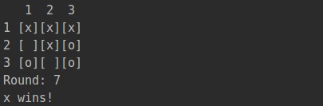
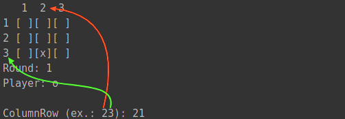

# Simple one-python-file tic-tac-toe
A command line tic tac toe version for two human-being players.



## Who was the game made for?
For you,
* tired of playing God of War \m/
* beginner python learner
* who wants to start collaborating with free software projects

or for myself, who wanted to remember my pytonic skills.

## Requirements
* (Optional) Docker
* Python 3

## How do run it

    $ git clone https://github.com/colares/py-tic-tac-toe.git
    $ cd py-tic-tac-toe
    
### From your local Python env 
    $ python main.py

### If you're a docker person

    docker run -it --rm --name tic-tac-toe \
      -v "$PWD":/usr/src/myapp \
      -w /usr/src/myapp python:3 \
      python main.py
      
## How to play it
I hadn't planned to create this section. But I did, since the user interface is not THAT amazing.

**Consider this as an opportunity to collaborate :)**



* Set a pair of numbers, from 1 to 3 each. 
* The first number stands for the column. The second, the line.
* Example: ```23```. Column ```2```, line ```3```.
* Press ```Enter``` and let your enemy make a move. This war, my friend.
      
> **Buckle up and enjoy a marvel experience! :)** -- Thiago Colares
      
## License
This project is licensed under the terms of the [GNU General Public License v3.0](https://github.com/colares/py-tic-tac-toe/blob/master/LICENSE "GNU General Public License v3.0")
